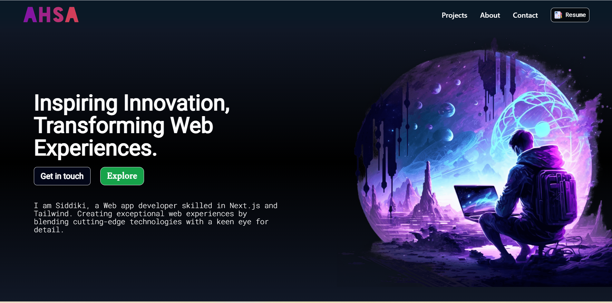

 💫 About Me:
 Hey there! 👋 I'm Abdul Hais Siddiki Ansary   🚀 Passionate Frontend Developer with expertise in React.js and Next.js   🛠️ Skills - **Programming Languages:** JavaScript, Java, C - **Frameworks/Libraries:** React.js, Next.js, Redux Toolkit - **CSS Frameworks:** Tailwind CSS, Bootstrap - **Version Control:** Git, GitHub - **UI/UX Design:** Responsive Web Design - **Problem Solving:** Strong analytical skills - **Teamwork:** Collaborative and communicative   🎓 Education - B.Sc Computer Science (Honours) from University of Kalyani   🌐 Connect with me - [LinkedIn](http://www.linkedin.com/in/siddiki-345433285) - [Portfolio](https://siddikiansary.web.app)  📚 Certificates - [The Complete JavaScript Course From Zero to Expert](https://shorturl.at/osVX8) - [React - The Complete Guide (incl. React Router & Redux)](https://shorturl.at/ABNY2) - [Career Essentials in Generative AI by Microsoft and LinkedIn](https://lnkd.in/ewPv75Rg)  Let's collaborate and build amazing web experiences together! 🚀 

 💻 Tech Stack:
                
📊 GitHub Stats:
 
 

---

<!-- Proudly created with GPRM ( https://gprm.itsvg.in ) -->
